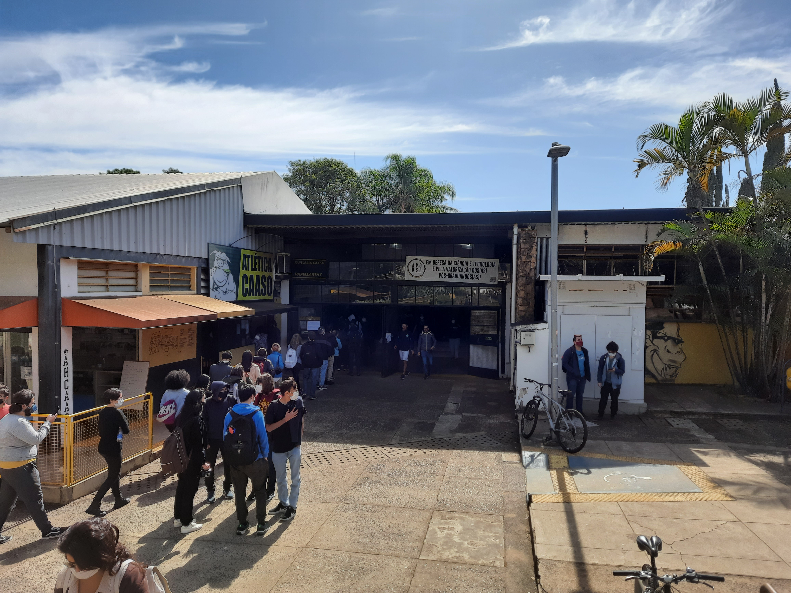

# Uso de técnicas de equalização por histogramas para melhorar o contraste de fotos da USP São Carlos

Projeto final da disciplina de Processamento de Imagens.

## Resumo
 
Aplicação da técnica _contrast limited adaptive histogram equalization_ como forma de melhorar o contraste em fotos em preto e branco e também coloridas. Vamos comparar essa técnica com outras técnicas, como o _adaptive histogram equalization_ e a _global histogram equalization_. Iremos testar essas técnicas em fotos da USP São Carlos retiradas pelos próprios integrantes do grupo em situações desafiadoras do ponto de vista da iluminação (ex: fotos contra fontes de luz, a noite ou com grandes diferenças de iluminação).

## Aplicação

Melhoramento de imagem.

## Relátório

O principal objetivo do projeto é melhorar imagens com grandes variações de luminosidade de modo a facilitar a visualização de detalhes escondidos. A ideia é comparar as técnicas _contrast limited adaptive histogram equalization_, _adaptive histogram equalization_ e _global histogram equalization_ além de tentar desenvolver uma implementação própria, em python, da _contrast limited adaptive histogram equalization_.

### Imagens

Nesta primeira etapa, utilizamos a imagem de uma das entradas que dão acesso ao restaurante universitário numa situação de muita luminosidade.

As imagens foram retiradas pelos próprios integrantes do grupo em alguns locais do campus USP São Carlos.

### Etapas

- Testar as técnicas já implementadas na biblioteca OpenCV, isso é,  _contrast limited adaptive histogram equalization_, _adaptive histogram equalization_ e _global histogram equalization_, e fazer uma comparação.
- Desenvolver a nossa própria implementação de _contrast limited adaptive histogram equalization_.

## Nomes
- Danilo Alves (daniloalves@usp.br)
- Amira Gayatri (amiragayatri@usp.br)
- Bernardo Barreto de Abreu (berbabreu@usp.br)
